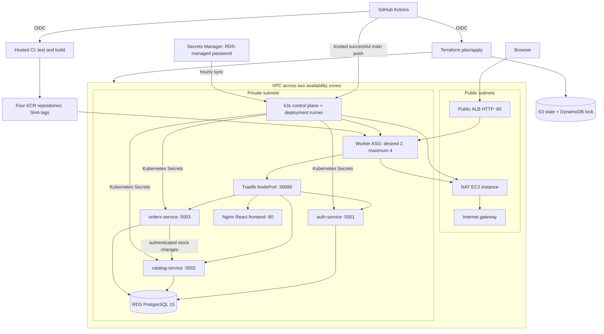

# Implemented architecture

All application resources are in namespace `marketly`. HPA controls 2–4 orders
replicas using CPU metrics. One shared signing key supports local JWT verification
and authenticated inventory updates. Database credentials are injected at deployment
and refreshed by a systemd timer; ECR pull credentials refresh hourly.

The root module composes all eight required modules. Nodes have no public IPs or
SSH rules and use SSM for operator access. Workers are registered automatically
with the ALB target group through the ASG attachment. Traefik uses cluster-wide
service routing, so NodePort traffic can reach pods on another node.

This diagram describes the configuration, not proof of a live deployment.
`aws-architecture.svg` and `.png` remain the original assignment reference;
this Markdown diagram is the current implementation source of truth. RDS native
backups are configured; separate S3 database exports are not implemented.

For the recorded deployment, the existing capstone VPC and internet gateway
were reused as read-only data sources because the region's VPC quota was full.
Terraform created isolated subnet ranges `10.0.10.0/24`–`10.0.13.0/24` and
separate route tables/security groups. The original workers and database remain
outside this state. See `LIVE_EVIDENCE.md` for deployment and teardown records.
